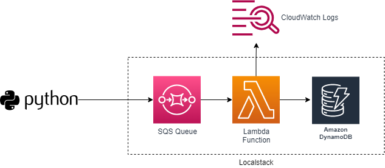

## Running AWS Lambda Function on LocalStack

This repository includes a sample AWS infrastructure built on *LocalStack* using Terraform. The following diagram illustrates the high level workflow of the solution:



A python client sends a Json message to a *SQS* queue which will trigger the *Lambda function* that is also written in Python. The lambda function parses the event payload and create a new item in a *DynamoDB* table. In addition, the lambda function writes logging data to *CloudWatch Logs*.

The purpose of this solution is to create the AWS infrastructure and run the entire solution locally. AWS CLI commands will be used to query both CloudWatch logs and the DynamoDB table.  

The repository is organized with the following folder structure:
```
.
├── README.md
├── lambda
│   └── app.py
├── localstack
│   └── docker-compose.yml
├── python
│   ├── dynamodb.py
│   ├── receive-sqs.py
│   └── send-sqs.py
└── terraform
    ├── dynamodb.tf
    ├── iam.tf
    ├── lambda.tf
    ├── main.tf
    ├── providers.tf
    └── sqs-dynamodb.tf
```
- The `localstack` folder includes a docker-compose.yml file to run LocalStack. 
- The `lambda` folder includes the lambda function's (pythong) code, app.py.
- The `terraform` folder contains Terraform configuration for the entire infrastructure.
- The `python` folder includes some sample python code that uses the AWS `boto3` library to work with SQS and DynamoDB.

## Prerequisites

The following are required for this solution:
- Docker and Docker Compose
- Python 3.8
- Terraform 

## Set up and Testing

1. Start LocalStack:
```
# in the localstack folder
docker-compose up -d
```

2. Provision the Infrastructure:
```
# in the terraform folder
tf init
tf apply -auto-approve
```

3. Send a testing message to the SQS queue
```
# in the python folder
python3 send-sqs.py
```
4. Check the results
> Note: `awsl` is an alias for `aws --endpoint-url=http://localhost:4566`. You can also [awslocal](https://github.com/localstack/awscli-local) if it works for you (I personally found it to be problematic).

Query the DyanmoDB table
```
awsl dynamodb scan --table-name users

{
    "Items": [
        {
            "last_name": {
                "S": "azjqbuviys"
            },
            "username": {
                "S": "cjolzhairo"
            }
        }
    ],
    "Count": 1,
    "ScannedCount": 1,
    "ConsumedCapacity": null
}

```
Get the log events from the latest log stream in CloudWatch logs:
```
awsl logs get-log-events \
--log-group-name $(awsl logs describe-log-groups | jq '.logGroups[0].logGroupName' -r) \
--log-stream-name $(awsl logs describe-log-streams --log-group $(awsl logs describe-log-groups | jq '.logGroups[0].logGroupName' -r) | jq '.logStreams' | jq 'sort_by(.lastIngestionTime) | reverse |.[0].logStreamName' -r)

{
    "events": [
        {
            "timestamp": 1640637945448,
            "message": "[INFO]\t2021-12-27T20:45:44.919Z\t\tFound credentials in environment variables.",
            "ingestionTime": 1640637945629
        },
        {
            "timestamp": 1640637945470,
            "message": "\u001b[32mSTART RequestId: 1f852243-2e93-10ae-d40a-d026e6ffdabe Version: $LATEST",
            "ingestionTime": 1640637945629
        },
        {
            "timestamp": 1640637945482,
            "message": "\u001b[0m",
            "ingestionTime": 1640637945629
        },
        {
            "timestamp": 1640637945493,
            "message": "[INFO]\t2021-12-27T20:45:44.963Z\t1f852243-2e93-10ae-d40a-d026e6ffdabe\tBefore creating item in DynamoDB",
            "ingestionTime": 1640637945629
        },
        {
            "timestamp": 1640637945504,
            "message": "[INFO]\t2021-12-27T20:45:45.32Z\t1f852243-2e93-10ae-d40a-d026e6ffdabe\tItem created in DynamoDB",
            "ingestionTime": 1640637945629
        },
        {
            "timestamp": 1640637945527,
            "message": "\u001b[32mEND RequestId: 1f852243-2e93-10ae-d40a-d026e6ffdabe",
            "ingestionTime": 1640637945629
        },
        {
            "timestamp": 1640637945538,
            "message": "\u001b[0m",
            "ingestionTime": 1640637945629
        },
        {
            "timestamp": 1640637945561,
            "message": "\u001b[32mREPORT RequestId: 1f852243-2e93-10ae-d40a-d026e6ffdabe\tInit Duration: 1123.56 ms\tDuration: 72.89 ms\tBilled Duration: 73 ms\tMemory Size: 1536 MB\tMax Memory Used: 42 MB\t",
            "ingestionTime": 1640637945629
        },
        {
            "timestamp": 1640637945572,
            "message": "\u001b[0m",
            "ingestionTime": 1640637945629
        }
    ],
    "nextForwardToken": "f/00000000000000000000000000000000000000000000000000000008",
    "nextBackwardToken": "b/00000000000000000000000000000000000000000000000000000000"
}
```

## Additional Sample Scripts
```
# Get the name of the first log group
awslocal logs describe-log-groups | jq '.logGroups[0].logGroupName' -r
q
# Get all log streams from the first log group
awsl logs describe-log-streams --log-group $(awsl logs describe-log-groups | jq '.logGroups[0].logGroupName' -r)

# Get the first log stream
awsl logs describe-log-streams --log-group $(awsl logs describe-log-groups | jq '.logGroups[0].logGroupName' -r) | jq '.logStreams[0].logStreamName' -r

# Get the log eventq
awsl logs get-log-events \
--log-group-name $(awsl logs describe-log-groups | jq '.logGroups[0].logGroupName' -r) \
--log-stream-name $(awsl logs describe-log-streams --log-group $(awsl logs describe-log-groups | jq '.logGroups[0].logGroupName' -r) | jq '.logStreams[0].logStreamName' -r) \
> /mnt/c/temp/lambda-logs.json

# Get the name of the latest log stream
awsl logs describe-log-streams --log-group $(awsl logs describe-log-groups | jq '.logGroups[0].logGroupName' -r) | jq '.logStreams' | jq 'sort_by(.lastIngestionTime) | reverse |.[0].logStreamName' -r

# Get events from the latest log stream
awsl logs get-log-events \
--log-group-name $(awsl logs describe-log-groups | jq '.logGroups[0].logGroupName' -r) \
--log-stream-name $(awsl logs describe-log-streams --log-group $(awsl logs describe-log-groups | jq '.logGroups[0].logGroupName' -r) | jq '.logStreams' | jq 'sort_by(.lastIngestionTime) | reverse |.[0].logStreamName' -r) \
> /mnt/c/temp/lambda-logs.json

```


## Some Known Issues and Workarounds
When running lambda functions in LocalStack context, you may experience connectivity and timeout issues. Below are a couple of workarounds:
1. Inside the lambda function, the hostname of the endpoint url should be retrieved from LOCALSTACK_HOSTNAME as documented [here](https://docs.localstack.cloud/localstack/configuration/).
2. The `network_mode` of your docker-compose.yml has to set to 'bridge', as explained [here](https://github.com/localstack/localstack/issues/2875).

